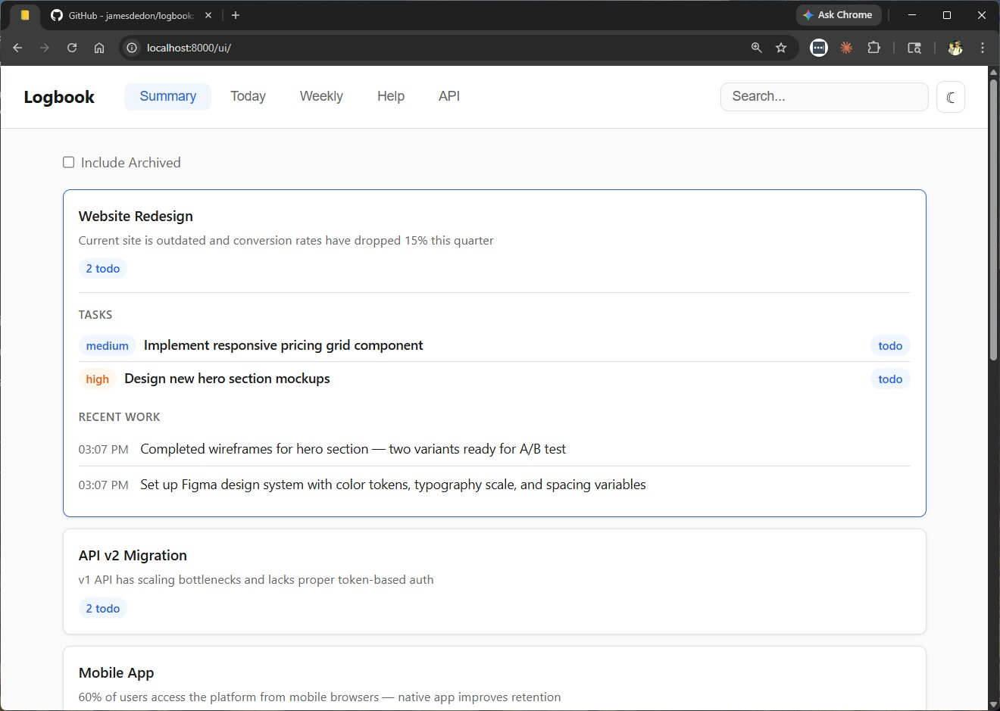
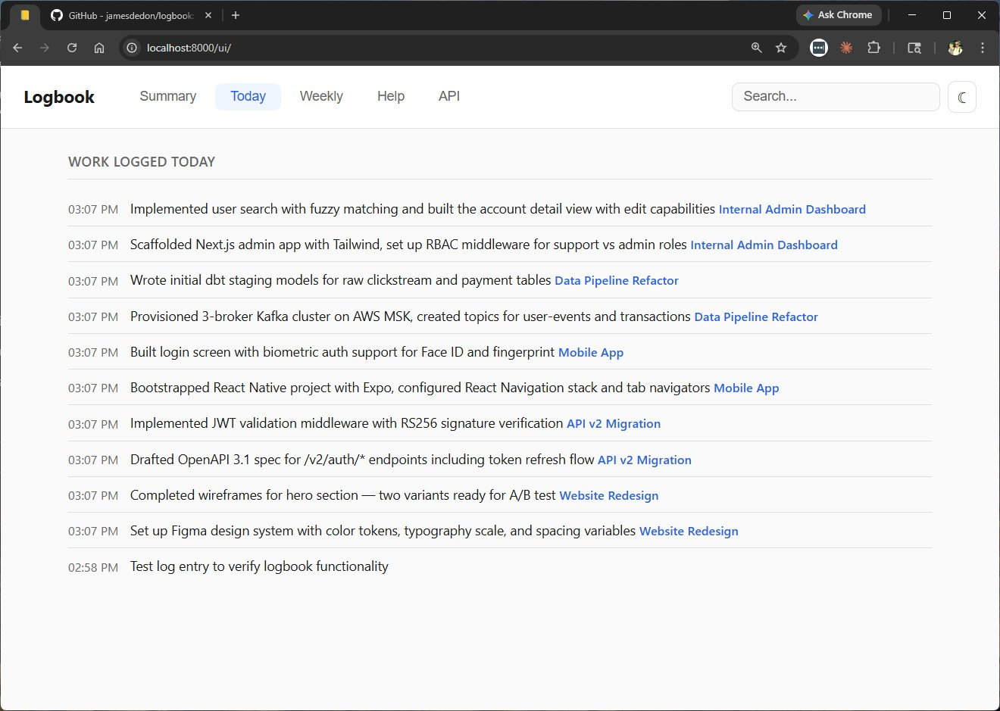
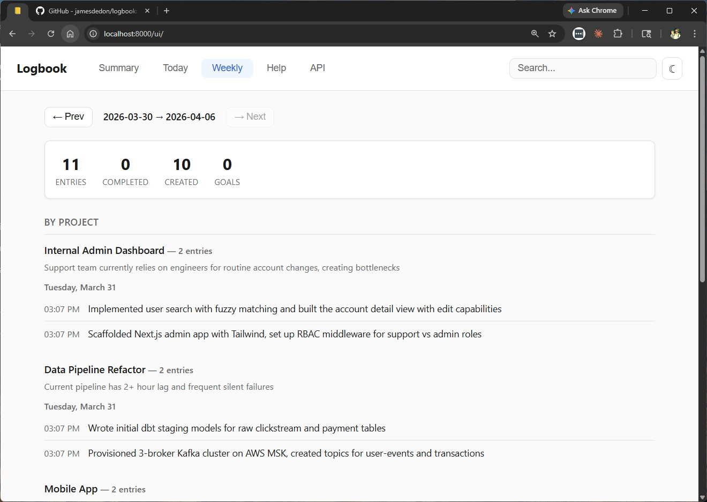

# Logbook

Local-first agentic work journal and planning tool. Runs on your computer with a REST API designed for AI agent consumption. Includes a CLI, MCP server for Claude Code, and a web dashboard.

## What is Logbook?

Logbook is a personal work journal that runs quietly in the background on your computer. It keeps track of what you've worked on, what you're working on now, and what's coming up next.

The key difference from a regular to-do list: Logbook is designed to work *with* your AI assistant (Claude Code). Claude can read from and write to your journal automatically, so you don't have to remember to update it yourself.

Think of it as a work diary that writes itself.

## Why would I want this?

When you work with Claude Code, things move fast. You might fix three bugs, refactor a module, and start a new feature all in one session. By the end of the week, it's hard to remember what happened on Tuesday.

Logbook solves this by:

- **Recording work as it happens.** Claude logs what it did after completing tasks, so you have a running record without doing anything.
- **Helping you plan.** You can create projects, set goals, and break work into tasks with priorities. Claude can check what's next and suggest what to work on.
- **Capturing intent.** Projects and goals have a motivation field, tasks have a rationale — so you always know *why* something exists, not just what it is.
- **Letting you search everything.** Can't remember where that authentication fix went? Search "auth" and Logbook finds every project, task, and log entry that mentions it.
- **Giving you weekly reports.** Need to remember what you accomplished last week? One command and you have a full summary grouped by project and day. Export it as markdown to share with your team.
- **Showing a dashboard.** Pull up the web UI at `http://localhost:8000/ui/` for standups — project cards, timelines, and weekly stats at a glance.

## Features

- **Projects, goals, tasks** with priorities, dependencies, and motivation/rationale fields
- **Work log** with timestamps and optional git metadata
- **Summary endpoints**: today, next actions, blocked tasks, weekly report
- **Full-text search** across all entities (FTS5 with stemming and prefix matching)
- **Markdown export** for weekly reports, filterable by project
- **Web dashboard** at `http://localhost:8000/ui/` — summary cards, today timeline, weekly report with navigation, full-text search, light/dark theme
- **CLI** (`logbook`) for terminal workflows
- **MCP server** for native Claude Code integration (18 tools)
- **REST API** with clean JSON responses for any agent or script
- **SQLite** — single file, no external dependencies
- **Cross-platform** — runs on Linux and macOS

## How it works

Logbook has four parts:

1. **A server** that runs on your computer and stores everything in a small database file. Once set up, it starts automatically when your computer boots. You never need to think about it.

2. **A command-line tool** (`logbook`) that lets you interact with it from your terminal. You can log work, check your tasks, see summaries, and search.

3. **A web dashboard** at `http://localhost:8000/ui/` for visual overviews. Three tabs — Summary (project cards you can click to expand), Today (timeline), and Weekly (stats + project-grouped entries with week navigation). Includes full-text search and a light/dark theme toggle.

4. **A connection to Claude Code** so that Claude can use Logbook directly. When you start a session, Claude can check what's on your plate. When you finish work, Claude can log it.

## Getting started

### Prerequisites

- Python 3.11 or newer
- Claude Code installed
- Git (to clone the project)

### Installation

```bash
git clone git@github.com:jamesdedon/logbook.git ~/.logbook
cd ~/.logbook
uv venv
uv pip install -e .
```

Add the CLI to your PATH so it's available from any directory or virtual environment:

```bash
# For zsh (macOS default)
echo 'export PATH="$HOME/.logbook/.venv/bin:$PATH"' >> ~/.zshrc
source ~/.zshrc

# For bash
echo 'export PATH="$HOME/.logbook/.venv/bin:$PATH"' >> ~/.bashrc
source ~/.bashrc
```

### Start the server

The easiest way — works on both Linux and macOS:

```bash
# Run database migrations
uv run alembic upgrade head

# Install and start as a system service (systemd on Linux, launchd on macOS)
logbook install-service
```

This creates the appropriate service file for your platform and starts the server. It will restart automatically on boot.

### Verify it's running

```bash
curl http://localhost:8000/health
```

You should see: `{"status":"ok"}`

The API is available at `http://localhost:8000`. OpenAPI docs at `/docs`. Web dashboard at `http://localhost:8000/ui/`.

### Connect Claude Code

Run this once:

```bash
claude mcp add logbook -s user -e LOGBOOK_URL=http://localhost:8000 -- logbook-mcp
```

That's it. Claude Code now has access to Logbook in every session.

## Daily usage

### Things you can say to Claude Code

You don't need to memorize commands. Just talk to Claude naturally:

- "What's on my plate?" — Claude checks Logbook for your active tasks and priorities.
- "Log that we finished the API refactor." — Claude creates a work log entry.
- "Create a task for fixing the login bug, high priority." — Claude adds it to your project.
- "What did I work on last week?" — Claude pulls up your weekly report.
- "Search for anything related to database migrations." — Claude searches across all your projects, tasks, and log entries.
- "Mark that task as done." — Claude updates the task status.

### Using the command line directly

```bash
# Log work (most common command)
logbook log "shipped the auth refactor"
logbook log "fixed deployment bug" --project <ID> --commit abc123
logbook log-update <ID> -d "corrected description"
logbook log-delete <ID>

# Tasks
logbook tasks                          # active tasks
logbook task create <PROJECT> "title" --priority high --rationale "why this matters"
logbook task done <ID>

# Planning
logbook summary                        # full overview
logbook today                          # today's activity
logbook next                           # what to work on next
logbook blocked                        # blocked tasks
logbook weekly                         # weekly report
logbook weekly -w 1 -p <PROJECT>       # last week, single project

# Search
logbook search "auth"                  # search everything
logbook search "database" -t task      # search only tasks

# Export
logbook export                         # markdown to stdout
logbook export -o report.md            # save to file
logbook export -p <PROJECT> -o standup.md  # single project

# Projects & goals
logbook project create "my-project" --motivation "why this project exists"
logbook project archive <ID>          # archive a project
logbook project unarchive <ID>        # restore an archived project to active
logbook projects --all                # list all projects including archived
logbook goal create <PROJECT> "Ship v1" --target 2026-04-15 --motivation "what success looks like"

# Service management
logbook install-service                # install as system service (Linux/macOS)
logbook restart                        # reinstall package and restart service

# All commands support --json for machine-readable output
logbook summary --json
```

### Web dashboard

Open `http://localhost:8000/ui/` in your browser. Useful for standups or quick status checks.

- **Summary tab** — Project cards with task count pills. Click a card to expand and see its tasks (with priority pills and rationale) and recent work log timeline.

  

- **Today tab** — Timeline of today's logged work and completed tasks grouped by project.

  

- **Weekly tab** — Stats bar (entries, tasks completed/created, goals), work grouped by project with motivation shown, completed tasks. Navigate between weeks with prev/next buttons.

  
- **Search** — Type in the search box to search across all projects, goals, tasks, and work log entries. Results are grouped by type with highlighted matches.
- **Theme** — Light/dark mode toggle in the header. Inherits your system preference by default.

### How information is organized

- **Projects** are the top level. You might have one for each repo, initiative, or area of work. Each has a motivation field for why it exists.
- **Goals** are milestones within a project — things like "Ship v1" or "Migrate to new database." Each has a motivation field for what success looks like.
- **Tasks** are concrete work items. They have priorities (low, medium, high, critical), a rationale field for why they're needed, and can depend on each other (Task B can't start until Task A is done).
- **Log entries** are timestamped records of work done. They can be linked to a project and task, or standalone.

Everything is searchable.

## Concepts

### What does "blocked" mean?

A task is blocked when it depends on another task that isn't finished yet. For example, you can't deploy code before the tests pass. Logbook tracks these dependencies so Claude (and you) can focus on work that's actually actionable right now.

### What does "next" do?

The "next" command shows you the most impactful things to work on right now. It considers:

1. Priority — critical and high-priority tasks come first.
2. Impact — tasks that unblock other tasks are ranked higher.
3. Age — older tasks get a slight boost so nothing sits forever.

It only shows tasks that aren't blocked, so everything it suggests is something you can actually start.

### Where is my data?

Everything is stored in a single file called `logbook.db` (default: `~/.logbook/logbook.db`). It's a standard SQLite database. Your data never leaves your computer — there's no cloud service, no account, no sync.

You can relocate everything by setting `LOGBOOK_HOME` to a different directory.

#### Backing up

Logbook has a built-in backup command that checkpoints the SQLite WAL first, so you get a clean, self-contained copy:

```bash
# Back up to a specific file
logbook backup /path/to/backup/logbook.db

# Back up to your configured backup directory (see below)
logbook backup
```

To configure a default backup directory so you can run `logbook backup` without arguments:

```bash
logbook config set backup_path /mnt/nas/logbook   # or any path you like
```

#### Restoring from a backup

```bash
# Restore from a specific file
logbook restore /path/to/backup/logbook.db

# Restore from your configured backup directory
logbook restore
```

The restore command stops the service, replaces the database, and restarts the service automatically.

#### Manual backup

Since the database is a single SQLite file, you can also just copy it directly. Make sure to checkpoint the WAL first so nothing is left in the write-ahead log:

```bash
sqlite3 ~/.logbook/logbook.db "PRAGMA wal_checkpoint(TRUNCATE);"
cp ~/.logbook/logbook.db /your/backup/location/logbook.db
```

## REST API

All responses use a consistent envelope:

```json
{"data": {...}, "meta": {"total": 42, "limit": 20, "offset": 0}}
```

### Endpoints

| Area | Endpoints |
|------|-----------|
| Projects | `POST/GET /projects`, `GET/PATCH/DELETE /projects/{id}` |
| Goals | `POST/GET /projects/{id}/goals`, `GET/PATCH/DELETE /goals/{id}` |
| Tasks | `POST /projects/{id}/tasks`, `GET /tasks`, `GET/PATCH/DELETE /tasks/{id}` |
| Dependencies | `POST/DELETE /tasks/{id}/dependencies` |
| Work Log | `POST/GET /log`, `GET/PATCH/DELETE /log/{id}` |
| Summary | `GET /summary`, `/summary/today`, `/summary/next`, `/summary/blocked`, `/summary/weekly` |
| Export | `GET /summary/export/weekly` |
| Search | `GET /search?q=keyword` |
| Web UI | `GET /ui/` |

### Task filtering

`GET /tasks` supports: `status`, `priority`, `project_id`, `goal_id`, `blocked`, `tag`, `q` (text search), `sort`, `limit`, `offset`.

## Updating

When new features are added:

```bash
cd ~/.logbook
git pull
logbook restart
```

Database migrations are applied automatically via the service configuration.

## Stack

- Python 3.11+, FastAPI, SQLAlchemy (async), SQLite via aiosqlite
- Alembic for migrations
- Typer + Rich for CLI
- MCP SDK for agent integration
- Vanilla HTML/CSS/JS for web dashboard (no build step)
