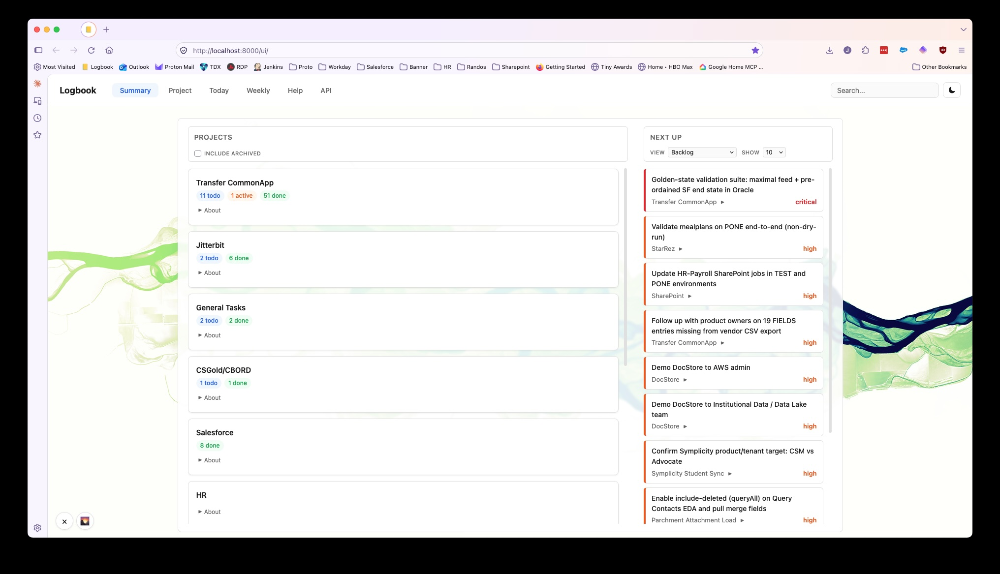
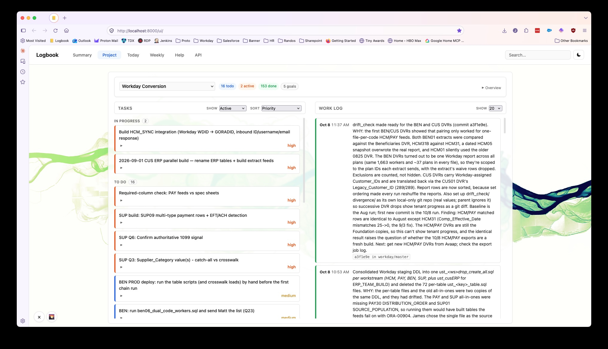
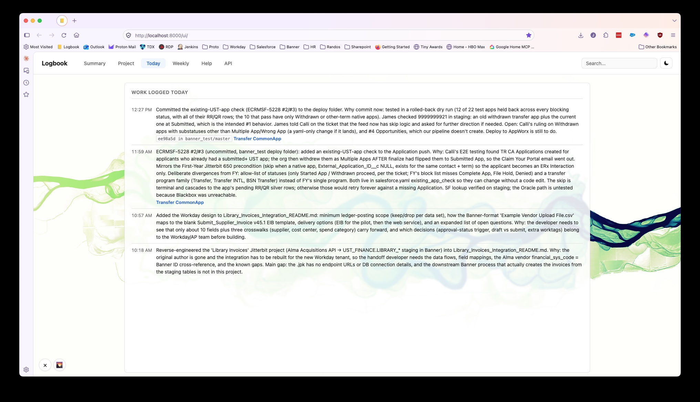
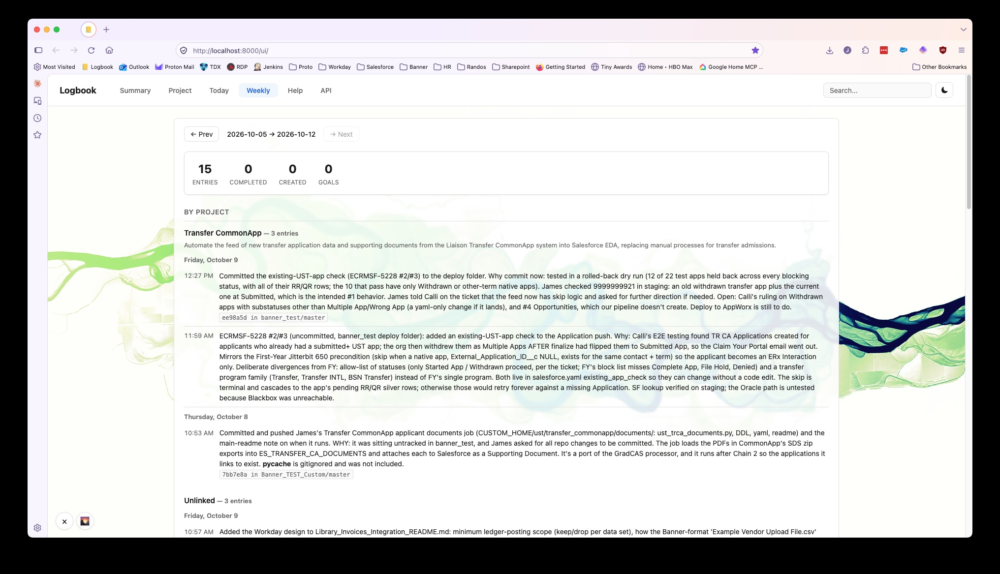

# Logbook

Local-first agentic work journal and planning tool. Runs on your computer with a REST API designed for AI agent consumption. Includes a CLI, MCP server for Claude Code, and a web dashboard.

## What is Logbook?

Logbook is a personal work journal that runs quietly in the background on your computer. It keeps track of what you've worked on, what you're working on now, and what's coming up next.

The key difference from a regular to-do list: Logbook is designed to work *with* your AI assistant (Claude Code). Claude can read from and write to your journal automatically, so you don't have to remember to update it yourself.

Think of it as a work diary that writes itself.

## Why would I want this?

When you work with Claude Code, things move fast. You might fix three bugs, refactor a module, and start a new feature all in one session. By the end of the week, it's hard to remember what happened on Tuesday.

Logbook solves this by:

- **Recording work as it happens.** Claude logs what it did after completing tasks, so you have a running record without doing anything.
- **Helping you plan.** You can create projects, set goals, and break work into tasks with priorities and due dates. Claude can check what's scheduled next, what's waiting in the backlog, and suggest what to work on.
- **Capturing intent.** Projects and goals have a motivation field, tasks have a rationale — so you always know *why* something exists, not just what it is.
- **Letting you search everything.** Can't remember where that authentication fix went? Search "auth" and Logbook finds every project, task, and log entry that mentions it.
- **Giving you weekly reports.** Need to remember what you accomplished last week? One command and you have a full summary grouped by project and day. Export it as markdown to share with your team.
- **Showing a dashboard.** Pull up the web UI at `http://localhost:8000/ui/` for standups — project cards, a per-project workspace, timelines, and weekly stats at a glance.

## Features

- **Projects, goals, tasks** with priorities, dependencies, due dates, size estimates, notes, and motivation/rationale fields
- **Work log** with timestamps, markdown descriptions, and optional git metadata
- **Two task queues**: *Scheduled* (dated tasks, soonest first) and *Backlog* (undated tasks, ranked by priority)
- **Summary endpoints**: today, scheduled, backlog, blocked tasks, weekly report
- **Full-text search** across all entities (FTS5 with stemming and prefix matching)
- **Markdown export** for weekly reports, filterable by project
- **Web dashboard** at `http://localhost:8000/ui/` — two-column summary (projects + Next Up rail), a Project tab for working one project at a time, today timeline, weekly report with navigation, full-text search, light/dark theme, optional background image
- **CLI** (`logbook`) for terminal workflows
- **MCP server** for native Claude Code integration (26 tools)
- **REST API** with clean JSON responses for any agent or script
- **SQLite** — single file, no external dependencies
- **Cross-platform** — runs on Linux and macOS

## How it works

Logbook has four parts:

1. **A server** that runs on your computer and stores everything in a small database file. Once set up, it starts automatically when your computer boots. You never need to think about it.

2. **A command-line tool** (`logbook`) that lets you interact with it from your terminal. You can log work, check your tasks, see summaries, and search.

3. **A web dashboard** at `http://localhost:8000/ui/` for visual overviews. Tabs for Summary (projects on the left, a Next Up rail on the right), Project (one project's tasks and work log side by side), Today (timeline), Weekly (stats + project-grouped entries with week navigation), Help, and API (interactive OpenAPI docs). Includes full-text search, light/dark theme toggle, and an optional custom background image.

4. **A connection to Claude Code** so that Claude can use Logbook directly. When you start a session, Claude can check what's on your plate. When you finish work, Claude can log it.

## Getting started

### Prerequisites

- Python 3.11 or newer
- Claude Code installed
- Git (to clone the project)

### Installation

```bash
git clone git@github.com:jamesdedon/logbook.git ~/.logbook
cd ~/.logbook
uv venv
uv pip install -e .
```

### Start the server

```bash
# Run database migrations
uv run alembic upgrade head

# Install and start as a system service (systemd on Linux, launchd on macOS).
# Use `uv run` here: the `logbook` command isn't on your PATH until this step installs it.
uv run logbook install-service
```

This does three things:
1. Creates the appropriate service file for your platform and starts the server (restarts automatically on boot).
2. Installs `logbook` and `logbook-mcp` wrapper scripts to `~/.local/bin` (user-writable on macOS, Linux, and Fedora Silverblue) so they're available from any terminal. If the directory isn't on your `PATH`, the installer prints a one-line `export` hint for your shell rc file.
3. Registers the `logbook` MCP server with Claude Code at user scope, using `claude mcp add` when the `claude` command is on your PATH. If it isn't, it falls back to writing the entry into `~/.claude.json` directly. Either way, confirm it as described in [Connect Claude Code](#connect-claude-code) below.

### Verify it's running

```bash
curl http://localhost:8000/health
```

You should see: `{"status":"ok"}`

### Connect Claude Code

The server running doesn't mean Claude can use it yet; Claude Code needs the `logbook` MCP server registered. Check whether it is:

```bash
claude mcp get logbook
```

If that reports the server isn't found, register it yourself at user scope (so it's available in every project), using the absolute path to `logbook-mcp` inside the venv:

```bash
claude mcp add logbook -s user -e LOGBOOK_URL=http://localhost:8000 -- ~/.logbook/.venv/bin/logbook-mcp
```

Then run `claude mcp get logbook` again; it should show `Status: ✔ Connected`. Claude Code loads MCP servers when a session starts, so **restart any open Claude Code sessions** before the `logbook_*` tools appear.

> **If Claude Code is doing the install for you:** the new tools won't show up in the session that did the install, so start a fresh session to confirm. If `install-service` had to fall back to editing `~/.claude.json` (it says so in its output), the running session may also write its own copy of that file back over the new entry; run the `claude mcp add` command above to fix it.

The API is available at `http://localhost:8000`. OpenAPI docs at `/docs`. Web dashboard at `http://localhost:8000/ui/`.

The server binds to `127.0.0.1` by default, so it isn't reachable from other machines on your network. To expose it on the LAN, set `LOGBOOK_HOST=0.0.0.0` — but note there is no authentication.

If something looks wrong, `logbook doctor` checks the installation: runtime, service file, database, port, and the health endpoint.

## Daily usage

### Things you can say to Claude Code

You don't need to memorize commands. Just talk to Claude naturally:

- "What's on my plate?" — Claude checks Logbook for your scheduled tasks and backlog.
- "Log that we finished the API refactor." — Claude creates a work log entry.
- "Create a task for fixing the login bug, high priority, due Friday." — Claude adds it to your project.
- "What did I work on last week?" — Claude pulls up your weekly report.
- "Search for anything related to database migrations." — Claude searches across all your projects, tasks, and log entries.
- "Mark that task as done." — Claude updates the task status.

### Using Logbook with Claude Code

Logbook works best when each repo tells Claude which project its work belongs to, and when log entries record intent rather than repeating git.

#### Link each repo to a project

Add the project ID to the repo's `CLAUDE.md` so tasks and log entries are linked to it and not left orphaned:

```markdown
## Logbook

This repo's work belongs to the **My Project** logbook project
(id `01ABCDEFGHJKMNPQRSTVWXYZ00`). Pass this `project_id` to
`logbook_task_create` and `logbook_log` for work in this repo.
```

Find a project's ID with `logbook projects` (archived ones need `--all`).

#### Log the *why*, not the *what*

Git already records what changed. A log entry earns its place by capturing the intent that git loses: why the change was needed, what you found along the way, and what's next. Tasks work the same way, with the description saying what and the rationale saying why.

#### Conventions that keep the log useful

- **Log after each commit, with git metadata.** Pass `commits`, `repo` and `branch` to `logbook_log` so each entry links back to its commits.
- **Don't amend commits that have been logged.** `git commit --amend` changes the hash and breaks the link from the log entry. Make a new commit instead.
- **One entry per logical change.** If one change is committed to several sibling repos, write one entry for it. Log the copying separately only if something notable happened along the way.
- **Note loose ends on the task.** Open questions and blockers that are someone else's to fix go in the task's notes, so the context stays with the work.

### Using the command line directly

```bash
# Log work (most common command)
logbook log "shipped the auth refactor"
logbook log "fixed deployment bug" --project <ID> --task <ID> --commit abc123 --repo logbook --branch master
logbook log-update <ID> -d "corrected description"
logbook log-delete <ID>

# Tasks
logbook tasks                          # active tasks (--project, --status, --priority, --blocked)
logbook task create <PROJECT> "title" --priority high --rationale "why this matters"
logbook task create <PROJECT> "title" --due 2026-10-15 --estimate 90 --blocked-by <ID>
logbook task show <ID>
logbook task start <ID>
logbook task done <ID>
logbook task block <ID> --by <BLOCKER_ID>

# Planning
logbook summary                        # full overview
logbook today                          # today's activity
logbook next                           # scheduled queue: dated tasks, soonest/overdue first
logbook backlog                        # undated tasks, ranked by priority
logbook blocked                        # blocked tasks
logbook weekly                         # weekly report
logbook weekly -w 1 -p <PROJECT>       # last week, single project

# Search
logbook search "auth"                  # search everything
logbook search "database" -t task      # search only tasks

# Export
logbook export                         # markdown to stdout
logbook export -o report.md            # save to file
logbook export -p <PROJECT> -o standup.md  # single project

# Projects & goals
logbook project create "my-project" --motivation "why this project exists"
logbook project archive <ID>          # archive a project
logbook project unarchive <ID>        # restore an archived project to active
logbook projects --all                # list all projects including archived
logbook project show <ID>
logbook project update <ID> --motivation "..."
logbook project delete <ID>
logbook goals --project <ID>
logbook goal create <PROJECT> "Ship v1" --target 2026-04-15 --motivation "what success looks like"
logbook goal complete <ID>

# Service management
logbook install-service                # install as system service (Linux/macOS)
logbook restart                        # reinstall package and restart service
logbook doctor                         # check installation health
logbook config                         # show current configuration

# All commands support --json for machine-readable output
logbook summary --json
```

### Web dashboard

Open `http://localhost:8000/ui/` in your browser. Useful for standups or quick status checks.

- **Summary tab** — Two-column layout: project cards on the left (with an Include Archived toggle in the header), and a Next Up rail on the right. The rail's View selector switches between Scheduled (dated tasks with due/estimate chips, overdue highlighted), Backlog, Blocked, or a single project's scheduled tasks, with a show-count of 10 / 20 / 50 / All. It defaults to Backlog until something has a due date. Columns scroll independently with their headers pinned. Click a project card to expand and see its tasks (priority pills, rationale, a Dates section, and a "blocked" pill that shows the blocker on hover) and a Recent work timeline with its own page-size dropdown.

  

- **Project tab** — One project at a time with room to work. An overview pill holds the project selector, counts, and an expandable about section. Below it, two full-height columns: tasks on the left (filter by Active / To do / In progress / Blocked / Completed / All; sort by priority, due date, or created date) and the work log on the right. The selected project is remembered across reloads.

  

- **Today tab** — Timeline of today's logged work and completed tasks grouped by project.

  

- **Weekly tab** — Stats bar (entries, tasks completed/created, goals), work grouped by project with motivation shown, completed tasks. Navigate between weeks with prev/next buttons.

  
- **Search** — Type in the search box to search across all projects, goals, tasks, and work log entries. Results are grouped by type with highlighted matches; click a result to expand its full details (task notes are editable in place).
- **Help / API tabs** — An in-app guide (dashboard tabs, CLI commands, concepts), and the interactive OpenAPI docs embedded in the dashboard.
- **Theme** — Light/dark mode toggle in the header. Inherits your system preference by default.
- **Background image** — Pick a PNG or JPEG (up to 20 MiB) with the button in the lower-left corner. It's stored on the server (`$LOGBOOK_HOME/background.*`), so it follows you across browsers.

Descriptions, rationale, notes, and log entries render as markdown (raw HTML is escaped).

### How information is organized

- **Projects** are the top level. You might have one for each repo, initiative, or area of work. Each has a motivation field for why it exists.
- **Goals** are milestones within a project — things like "Ship v1" or "Migrate to new database." Each has a motivation field for what success looks like.
- **Tasks** are concrete work items. They move through `todo → in_progress → done` (or `cancelled`), have priorities (low, medium, high, critical), a rationale field for why they're needed, a notes field for findings, an optional due date and size estimate, and can depend on each other (Task B can't start until Task A is done). Logbook stamps `started_at` and `completed_at` as the status changes.
- **Log entries** are timestamped records of work done. They can be linked to a project and task, or standalone.

Everything is searchable.

## Concepts

### What does "blocked" mean?

A task is blocked when it depends on another task that isn't finished yet. For example, you can't deploy code before the tests pass. Logbook tracks these dependencies so Claude (and you) can focus on work that's actually actionable right now.

### Scheduled vs. backlog

Tasks fall into one of two queues depending on whether they have a due date:

- **Scheduled** (`logbook next`) is about *time*. It shows only dated tasks, ordered by due date with overdue and soonest first. Giving a task a due date is a commitment that moves it into this queue.
- **Backlog** (`logbook backlog`) is about *importance*. It shows undated, unblocked tasks ranked by:
  1. Priority — critical and high-priority tasks come first.
  2. Impact — tasks that unblock other tasks are ranked higher.
  3. Age — older tasks come first so nothing sits forever.

Priority orders the backlog but never pulls a task into the scheduled queue; only a due date does that. `logbook summary` shows both queues.

### Where is my data?

Everything is stored in a single file called `logbook.db` (default: `~/.logbook/logbook.db`). It's a standard SQLite database. Your data never leaves your computer — there's no cloud service, no account, no sync.

You can relocate everything by setting `LOGBOOK_HOME` to a different directory.

#### Backing up

Logbook has a built-in backup command that checkpoints the SQLite WAL first, so you get a clean, self-contained copy:

```bash
# Back up to a specific file
logbook backup /path/to/backup/logbook.db

# Back up to your configured backup directory (see below)
logbook backup
```

To configure a default backup directory so you can run `logbook backup` without arguments:

```bash
logbook config-set backup_path /mnt/nas/logbook   # or any path you like
```

#### Restoring from a backup

```bash
# Restore from a specific file
logbook restore /path/to/backup/logbook.db

# Restore from your configured backup directory
logbook restore
```

The restore command stops the service, replaces the database, and restarts the service automatically.

To replace the current database with another logbook database file (for example, when moving machines), use `logbook import-db /path/to/logbook.db`.

#### Manual backup

Since the database is a single SQLite file, you can also just copy it directly. Make sure to checkpoint the WAL first so nothing is left in the write-ahead log:

```bash
sqlite3 ~/.logbook/logbook.db "PRAGMA wal_checkpoint(TRUNCATE);"
cp ~/.logbook/logbook.db /your/backup/location/logbook.db
```

## REST API

All responses use a consistent envelope:

```json
{"data": {...}, "meta": {"total": 42, "limit": 20, "offset": 0}}
```

### Endpoints

| Area | Endpoints |
|------|-----------|
| Projects | `POST/GET /projects`, `GET/PATCH/DELETE /projects/{id}` |
| Goals | `POST/GET /projects/{id}/goals`, `GET/PATCH/DELETE /goals/{id}` |
| Tasks | `POST/GET /projects/{id}/tasks`, `POST /projects/{id}/tasks/batch`, `GET /tasks`, `GET/PATCH/DELETE /tasks/{id}` |
| Dependencies | `POST /tasks/{id}/dependencies`, `DELETE /tasks/{id}/dependencies/{blocker_id}` |
| Work Log | `POST/GET /log`, `GET/PATCH/DELETE /log/{id}` |
| Summary | `GET /summary`, `/summary/today`, `/summary/next`, `/summary/backlog`, `/summary/blocked`, `/summary/weekly` |
| Export | `GET /summary/export/weekly` |
| Search | `GET /search?q=keyword` |
| Background | `GET/PUT/DELETE /background` |
| Web UI | `GET /ui/` |

### Task filtering

`GET /tasks` supports: `status` (comma-separated, e.g. `todo,in_progress`), `priority`, `project_id`, `goal_id`, `blocked`, `tag`, `q` (text search), `sort`, `limit`, `offset`.

Anywhere a project ID is accepted, you can also pass the project's name (case-insensitive).

## Updating

When new features are added:

```bash
cd ~/.logbook
git pull
logbook restart
```

Database migrations are applied automatically via the service configuration.

## Stack

- Python 3.11+, FastAPI, SQLAlchemy (async), SQLite via aiosqlite
- Alembic for migrations
- Typer + Rich for CLI
- MCP SDK for agent integration
- Vanilla HTML/CSS/JS for web dashboard (no build step)
